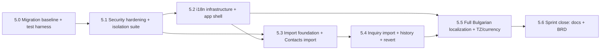
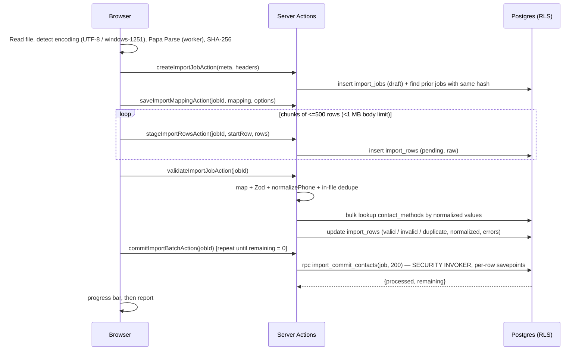

# Sprint 5 Implementation Plan — BrokerCRM

> **Status:** Proposed — pending sign-off on the decisions in §5
> **Author:** Principal Architect
> **Date:** 2026-10-05
> **Duration:** ~4 weeks (≈20 dev-days, see §7 for budget and cut list)
> **Companion file:** `docs/sprint-5-task-list.md` (checkbox task list mapped 1:1 to slices)

---

## 1. Sprint Theme

> **"Pilot-ready: lock the doors, load the data, speak Bulgarian."**
> Close the live tenant-isolation holes and prove isolation with automated tests. Let agencies onboard their existing spreadsheets safely and repeatably. Deliver the whole product in Bulgarian.

This sprint is about turning the finished operating loop (Sprints 0–4) into something we can put in front of a paying Bulgarian agency. It satisfies three pilot acceptance criteria from `business-description.md` that are still open:

| Pilot criterion (business-description §Pilot Acceptance Criteria) | Ref used here | Slice |
|---|---|---|
| "An inquiry can be created manually **or imported** without losing its original source." | **PAC-01** | 5.4 |
| "Automated tests prove that one agency cannot access another agency's records." | **PAC-10** | 5.0, 5.1 |
| "Failed or repeated imports do not silently create uncontrolled duplicates." | **PAC-11** | 5.3, 5.4 |
| Pilot "Included" list: "Bulgarian interface copy", "CSV import with mapping, validation, and error reporting" | **PIL-BG**, **PIL-CSV** | 5.2–5.5 |

---

## 2. Pre-Sprint Findings (verified 2026-10-04 against code + live Supabase)

These findings drive the prioritisation. Items marked 🔴 are **live security defects in the production project** (`emflwmivjachbnaqumnn`), confirmed through `pg_policies` and the Supabase security advisor.

| # | Finding | Severity | Fixed in |
|---|---|---|---|
| F-01 | 🔴 `agency_memberships` policy `authenticated_can_create_own_membership` only checks `user_id = auth.uid()`. **Any signed-in user can insert `{agency_id: <any>, role: 'owner', status: 'active'}` and take over any agency.** | Critical | 5.1 |
| F-02 | 🔴 `audit_log` policy `authenticated_can_insert_audit_logs` = `auth.uid() IS NOT NULL`. Any user can forge audit history in any agency. This breaks the "tamper-proof" premise of AD-020. | High | 5.1 |
| F-03 | 🔴 9 `SECURITY DEFINER` functions can be executed by `anon` over `/rest/v1/rpc/*`. These include `get_user_email(uuid)` (email lookup without login) and `seed_agency_defaults(uuid)` (writes into any agency). | High | 5.1 |
| F-04 | 🔴 `inviteMember` Server Action reads `agencyId` from the **form**, and calls the service-role `inviteUserByEmail` **before** any role check. | High | 5.1 |
| F-05 | 🔴 `owners_managers_can_invite` does not constrain `role` or `status`. A manager can insert an `owner` membership, or an `active` membership for any user id. | High | 5.1 |
| F-06 | `profiles` SELECT = any authenticated user. Every user can enumerate every user's email across all agencies (AD-023). This is a GDPR concern. | Medium | 5.1 |
| F-07 | Auth callback redirects to `${origin}${next}` with unvalidated `next`. This is an **open redirect** (`?next=@evil.com`). | Medium | 5.1 |
| F-08 | **No `proxy.ts` (Next 16) / `middleware.ts` exists.** `lib/supabase/middleware.ts#updateSession` is dead code, so sessions are never refreshed in the proxy layer. | Medium | 5.1 |
| F-09 | Dashboard layout instantiates the **service-role client on every page render** to activate invitations. | Medium | 5.1 |
| F-10 | `current_agency_id()` uses `LIMIT 1` with no ordering. If a user ever has 2 active memberships, tenant context becomes non-deterministic. No constraint prevents this (0 such users today). | Medium | 5.1 |
| F-11 | 9 functions have a mutable `search_path`. `pg_trgm` is in `public`. Leaked-password protection is off. | Low | 5.1 (`pg_trgm` deferred) |
| F-12 | Supabase **migration history table is empty**: migrations were applied manually. Three files are future-dated (`20261006…`, `20261010…`), so any migration created today would sort **before** them. | Process | 5.0 |
| F-13 | Docs say **Next.js 15**; the code runs **Next.js 16.3.3** (`middleware` → `proxy`, `revalidateTag` signature change). | Docs | 5.0 / 5.6 |
| F-14 | Today Screen computes "today" with the server's local clock (`tasks/repository.ts:130`). On Vercel that is **UTC, not Europe/Sofia**. | Medium | 5.5 |
| F-15 | Opportunity `currency` defaults to `'BGN'`. Bulgaria moved to the euro on 2026-01-01 (**confirm — see AD-037**). | Low | 5.5 |
| F-16 | BRD deferred items live in **§6** (not §9). The decision log runs to **AD-026**. AD-025 already settles the notification architecture. | Docs | 5.6 |

---

## 3. Prioritised Scope

### 3.1 In scope

| Priority | Item | Why now |
|---|---|---|
| **P0** | **Security hardening + automated RLS / tenant-isolation suite** (BRD §6 "Automated RLS Isolation Tests") | F-01…F-07 are exploitable today. PAC-10 is a pilot gate. No agency data should be imported (Slice 5.3) into a system that leaks across tenants. Blocking for everything else. |
| **P1** | **CSV Import — Contacts + Inquiries** (BRD §6 "CSV Import") | PIL-CSV, PAC-01 and PAC-11. Onboarding is "part of the product experience" (business principle). Without import, concierge onboarding means hand-typing an agency's spreadsheet. |
| **P1** | **Bulgarian localization** (BRD §6 "Bulgarian Localization", AD-003) | AD-003 said "localize before pilot". The pilot is the next milestone. i18n infrastructure goes in *before* import UI so new screens are built with message keys from day one. |
| P2 (folded into localization) | **Agency timezone (Europe/Sofia) + currency default** | "Today" being wrong for 2–3 h every evening undermines the Today Screen. It is also a prerequisite for Sprint 6 9 AM reminders (AD-025). |

### 3.2 Deferred (again) and why

| Item | New target | Reason |
|---|---|---|
| **Notifications & Reminders** (AD-025) | **Sprint 6** | Product-owner decision (2026-10-04). Slice 5.5 lays the timezone groundwork it needs. |
| **Smart Lists / saved filters** | **Sprint 6 (recommended top priority)** | ⚠️ `business-description.md` calls Smart Lists "a core pilot feature", but they are **not** in BRD §6. Add them to BRD §6 in Slice 5.6 so they are not lost. |
| **Opportunity CSV import** (with stage/broker mapping) | Sprint 6+ | Needs stage-name and broker mapping plus next-action seeding. Contacts and inquiries cover the onboarding critical path. |
| **Lightweight Requirement + Property reference** | Sprint 7 / post-validation | Listed as pilot "Included" in the brief but not yet in the BRD. Flag in BRD §6 (Slice 5.6). |
| **Offline draft & retry** | Post-pilot | Unchanged. |
| **Property inventory & integrations** | Post-pilot | Unchanged. |
| **Move `pg_trgm` out of `public`** | Backlog | Recreating trigram indexes has moderate risk for a WARN-level lint with no exploit path. |
| **Raw-import-row retention purge job** | Sprint 6 | Needs `pg_cron`, which arrives with notifications. Manual purge is documented in 5.3. |

---

## 4. Slice Breakdown

### Slice order and dependencies



| Slice | Est. (dev-days) | Week |
|---|---|---|
| 5.0 Migration baseline + test harness | 2 | 1 |
| 5.1 Security hardening + isolation suite | 4 | 1–2 |
| 5.2 i18n infrastructure + app shell | 2.5 | 2 |
| 5.3 Import foundation + Contacts import | 5 | 2–3 |
| 5.4 Inquiry import + history + revert | 3 | 3–4 |
| 5.5 Full Bulgarian localization + TZ/currency | 4 | 4 |
| 5.6 Sprint close (docs) | 0.5 | 4 |
| **Total** | **21** | (1 day over → see cut list §7) |

**Migration naming rule (applies to every slice):** `YYYYMMDDHHMMSS_description.sql` (L-006). After Slice 5.0, every new migration must sort **after** the last existing file. The dates shown below are indicative; use the real timestamp at implementation time.

---

### Slice 5.0 — Migration Baseline & Test Harness

**Goal:** a reproducible local database that matches production, and a test runner, so that 5.1 can be done test-first. Nothing user-visible ships.

#### Database / migrations
- **Fix future-dated files (F-12)** — rename, keeping dependency order:
  - `20261006000001_create_audit_log.sql` → `20261003000001_create_audit_log.sql`
  - `20261010000001_create_profiles.sql` → `20261003000002_create_profiles.sql`
  - `20261010000002_add_invitation_columns.sql` → `20261003000003_add_invitation_columns.sql`
- **Verify local == prod before repair:** `supabase db reset` locally, then `supabase db diff --linked --schema public` must be empty. Any drift becomes a corrective migration.
- **Baseline remote history:** `supabase migration repair --status applied <version>` for all 23 versions. This changes no data; it only writes the history table. Take a `pg_dump --schema-only` snapshot first.
- **Rule from now on:** prod schema changes only via `supabase db push`. No hand-applied SQL.
- `supabase/seed.sql` (local only): two agencies (`Alpha Imoti`, `Beta Estates`). Each has an owner, a manager, a broker, contacts, an inquiry, an opportunity, a task and a note. Users are created in `auth.users` with known UUIDs and passwords for manual testing.

#### Test tooling
- `supabase/tests/database/000-setup-tests-hooks.sql`: enables `pgtap`. Installs the test helpers (Supabase-documented `basejump-supabase_test_helpers` via `dbdev`, or an equivalent hand-rolled `tests` schema) that provide `tests.create_supabase_user()`, `tests.authenticate_as()` and `tests.clear_authentication()`.
- `supabase/tests/database/001-smoke.sql`: proves the harness works (an authenticated user sees their own agency's rows).
- **Vitest** for pure domain logic: `vitest`, `vite-tsconfig-paths`, `vitest.config.mts`, tests co-located as `src/**/*.test.ts`.
  - First test: `src/domain/contacts/phone.test.ts`, covering all formats documented in `phone.ts`.
- `package.json` scripts: `"test": "vitest run"`, `"test:watch": "vitest"`, `"test:db": "supabase test db"`, `"typecheck": "tsc --noEmit"`.

#### Domain / Actions / UI
- None.

#### Acceptance criteria
- **AC-5.0-1** `supabase db reset && supabase test db` passes on a clean machine with Docker running.
- **AC-5.0-2** `supabase migration list --linked` shows all 23 migrations as applied, and local and remote agree.
- **AC-5.0-3** `npm test` runs and the phone normalization suite passes (≥ 8 cases incl. invalid inputs).
- **AC-5.0-4** `supabase db diff --linked` reports no schema drift.

---

### Slice 5.1 — Security Hardening & Tenant-Isolation Suite

**Goal:** close F-01…F-11. Each exploit gets a **failing pgTAP regression test first**, then the fix. Add a structural "catalog guard" test so that future tables cannot ship without `agency_id` + RLS.
**FR IDs:** FR-SEC-01…12, FR-TST-01…06 (new) · **Pilot:** PAC-10

#### Database / migrations

**`20261005000001_harden_tenant_provisioning.sql`** (AD-027)
```sql
-- 1. Single active agency per user (makes current_agency_id() deterministic — F-10)
CREATE UNIQUE INDEX uq_one_active_membership_per_user
  ON agency_memberships(user_id) WHERE status = 'active';

-- 2. Atomic, server-side agency provisioning (replaces client-side 3-step signup, L-005)
CREATE OR REPLACE FUNCTION public.create_agency_with_owner(
  p_agency_name text, p_locale text DEFAULT 'bg'
) RETURNS uuid
LANGUAGE plpgsql SECURITY DEFINER SET search_path = public AS $$
DECLARE
  v_uid    uuid := (SELECT auth.uid());
  v_agency uuid;
  v_base   text;
BEGIN
  IF v_uid IS NULL THEN RAISE EXCEPTION 'not_authenticated' USING ERRCODE = '28000'; END IF;
  IF EXISTS (SELECT 1 FROM agency_memberships WHERE user_id = v_uid) THEN
    RAISE EXCEPTION 'already_member' USING ERRCODE = 'P0001';
  END IF;
  IF char_length(trim(p_agency_name)) NOT BETWEEN 2 AND 120 THEN
    RAISE EXCEPTION 'invalid_agency_name' USING ERRCODE = '22023';
  END IF;
  -- Cyrillic names strip to '' → fall back to 'agency'
  v_base := coalesce(nullif(trim(both '-' from regexp_replace(lower(p_agency_name), '[^a-z0-9]+', '-', 'g')), ''), 'agency');
  INSERT INTO agencies (name, slug)
    VALUES (trim(p_agency_name), v_base || '-' || substr(replace(gen_random_uuid()::text, '-', ''), 1, 6))
    RETURNING id INTO v_agency;
  INSERT INTO agency_memberships (user_id, agency_id, role, status, joined_at)
    VALUES (v_uid, v_agency, 'owner', 'active', now());
  PERFORM seed_agency_defaults(v_agency);   -- Slice 5.5 changes to (v_agency, p_locale)
  RETURN v_agency;
END $$;

-- 3. Invitation acceptance without the service-role client (F-09)
CREATE OR REPLACE FUNCTION public.accept_pending_invitations()
RETURNS integer LANGUAGE plpgsql SECURITY DEFINER SET search_path = public AS $$
DECLARE v_uid uuid := (SELECT auth.uid()); v_count integer;
BEGIN
  IF v_uid IS NULL THEN RAISE EXCEPTION 'not_authenticated' USING ERRCODE = '28000'; END IF;
  IF EXISTS (SELECT 1 FROM agency_memberships WHERE user_id = v_uid AND status = 'active') THEN
    RAISE EXCEPTION 'multi_agency_unsupported' USING ERRCODE = 'P0001';
  END IF;
  -- Activate the most recent invitation only (single-agency rule)
  UPDATE agency_memberships SET status = 'active', joined_at = now()
   WHERE id = (SELECT id FROM agency_memberships
                WHERE user_id = v_uid AND status = 'invited'
                ORDER BY invited_at DESC LIMIT 1);
  GET DIAGNOSTICS v_count = ROW_COUNT;
  RETURN v_count;
END $$;

-- 4. Remove the takeover vectors (F-01, F-05)
DROP POLICY IF EXISTS "authenticated_can_create_own_membership" ON agency_memberships;
DROP POLICY IF EXISTS "owners_managers_can_invite"              ON agency_memberships;
DROP POLICY IF EXISTS "authenticated_can_create_agency"         ON agencies;

CREATE POLICY "invite_insert" ON agency_memberships FOR INSERT WITH CHECK (
  agency_id = current_agency_id()
  AND status = 'invited'
  AND (current_user_role() = 'owner'
       OR (current_user_role() = 'manager' AND role = 'broker'))   -- AD-027 (confirm)
);
CREATE POLICY "invite_delete_pending" ON agency_memberships FOR DELETE USING (
  agency_id = current_agency_id() AND status = 'invited'
  AND current_user_role() IN ('owner', 'manager')
);
DROP POLICY IF EXISTS "owners_can_update_memberships" ON agency_memberships;
CREATE POLICY "owners_can_update_memberships" ON agency_memberships FOR UPDATE
  USING      (agency_id = current_agency_id() AND current_user_role() = 'owner')
  WITH CHECK (agency_id = current_agency_id() AND current_user_role() = 'owner');

-- 5. Membership identity is immutable (owner cannot re-point user_id/agency_id)
CREATE OR REPLACE FUNCTION prevent_membership_identity_change() RETURNS trigger
LANGUAGE plpgsql SET search_path = public AS $$
BEGIN
  IF NEW.user_id <> OLD.user_id OR NEW.agency_id <> OLD.agency_id THEN
    RAISE EXCEPTION 'membership_identity_immutable';
  END IF;
  RETURN NEW;
END $$;
CREATE TRIGGER trg_membership_identity BEFORE UPDATE ON agency_memberships
  FOR EACH ROW EXECUTE FUNCTION prevent_membership_identity_change();
```
> Pre-check before applying: `SELECT user_id FROM agency_memberships WHERE status='active' GROUP BY 1 HAVING count(*)>1` must return 0 rows (verified 0 on 2026-10-04).

**`20261005000002_harden_function_privileges.sql`** (AD-028)
- `ALTER FUNCTION … SET search_path = public` on the 9 functions flagged by the advisor (F-11).
- Supabase grants `EXECUTE` on new `public` functions to `anon` and `authenticated` **explicitly** (not only via `PUBLIC`), so the revokes must name those roles:

| Function(s) | Kind | `anon` | `authenticated` |
|---|---|---|---|
| `current_agency_id`, `current_user_role`, `shares_agency_with` (new) | RLS helper | REVOKE | GRANT |
| `create_agency_with_owner`, `accept_pending_invitations` | RPC | REVOKE | GRANT |
| `seed_agency_defaults`, `get_user_email`, `get_stage_name` | internal | REVOKE | REVOKE |
| `audit_opportunity_changes`, `audit_contact_status_changes`, `sync_opportunity_next_action`, `handle_new_user`, `*_search_vector_update`, `update_updated_at_column`, `prevent_membership_identity_change` | trigger | REVOKE | REVOKE |

- `ALTER DEFAULT PRIVILEGES IN SCHEMA public REVOKE EXECUTE ON FUNCTIONS FROM PUBLIC, anon, authenticated;` From now on every new function needs an explicit `GRANT`.
- Trigger functions still fire: `EXECUTE` is checked at `CREATE TRIGGER` time, not when the trigger fires.

**`20261005000003_harden_policies.sql`**
```sql
-- audit_log (F-02): tenant-scoped insert (keeps trigger inserts working); helper-based select
DROP POLICY IF EXISTS "authenticated_can_insert_audit_logs" ON audit_log;
DROP POLICY IF EXISTS "users_see_own_agency_audit_logs"    ON audit_log;
CREATE POLICY "tenant_insert" ON audit_log FOR INSERT WITH CHECK (agency_id = current_agency_id());
CREATE POLICY "tenant_select" ON audit_log FOR SELECT USING     (agency_id = current_agency_id());

-- agencies: replace inline subquery with helper (L-003)
DROP POLICY IF EXISTS "members_can_view_own_agency" ON agencies;
CREATE POLICY "members_can_view_own_agency" ON agencies FOR SELECT USING (id = current_agency_id());

-- profiles (F-06): self or colleagues only (revises AD-023)
CREATE OR REPLACE FUNCTION public.shares_agency_with(p_user uuid) RETURNS boolean
LANGUAGE sql STABLE SECURITY DEFINER SET search_path = public AS $$
  SELECT EXISTS (
    SELECT 1 FROM agency_memberships me
    JOIN agency_memberships them ON them.agency_id = me.agency_id
    WHERE me.user_id = (SELECT auth.uid()) AND me.status = 'active'
      AND them.user_id = p_user);
$$;
DROP POLICY IF EXISTS "authenticated_can_view_profiles" ON profiles;
CREATE POLICY "profiles_select_self_or_colleague" ON profiles FOR SELECT
  USING (id = (SELECT auth.uid()) OR shares_agency_with(id));
```
- **Dashboard toggle:** enable Leaked Password Protection (Auth → Password security).

#### Domain layer
- `src/domain/members/service.ts`
  - `inviteMember(ctx: AuthContext, email, role)`: takes `agencyId` from `AuthContext`, never from the form. **Role check happens before the admin call**: owner can invite any role; manager can invite `broker` only. It throws `DomainError('members.inviteForbidden')`.
  - `cancelInvitation(ctx, membershipId)`: moves the role/status guard from the action into the service. Deletes through the user client; the new `invite_delete_pending` policy replaces the admin-client delete.
- `src/domain/members/repository.ts`: expose `getMembership()` publicly. Remove the `memberService["repo"]` cast hack (violates L-002).
- `src/domain/agencies/` (new, small):
  - `validation.ts`: `createAgencySchema` (`agency_name` 2–120 chars, `locale` ∈ `bg|en`).
  - `service.ts`: `AgencyService.createWithOwner()` calls the RPC and maps PG error codes to `DomainError`.
- `src/lib/errors.ts` (new): `class DomainError extends Error { code: string; params?: Record<string, string | number> }`. It becomes a translation key in 5.2.

#### Server Actions
- `src/app/(auth)/signup/actions.ts` (new) `signupAction(prev, formData)`: Zod → `supabase.auth.signUp` (server client) → if a session exists, `rpc('create_agency_with_owner')` → redirect.
  - If email confirmation is enabled and there is no session, store `agency_name` in user metadata. Run the RPC on the first authenticated visit to `/onboarding` (new minimal page shown when the user has no membership).
- `src/app/(auth)/auth/callback/route.ts`:
  - validate `next` with `isSafeRelativePath()` (must start with `/` and not `//` or `/\`) (F-07).
  - replace `type as any` with `EmailOtpType`.
  - replace the activation loop with `rpc('accept_pending_invitations')`.
- `src/app/(dashboard)/settings/team/actions.ts`: all actions use `getAuthContext()`, and the `agencyId` form field is removed. `inviteMember`/`cancelInvitation` delegate to the service.
- `src/app/(dashboard)/layout.tsx`: **remove** the service-role invitation activation (F-09). If the user has no active membership, redirect to `/onboarding`.

#### Infrastructure
- `src/proxy.ts` (new, Next 16 convention; F-08):
  ```ts
  import type { NextRequest } from 'next/server';
  import { updateSession } from '@/lib/supabase/proxy';
  export async function proxy(request: NextRequest) { return updateSession(request); }
  export const config = {
    matcher: ['/((?!_next/static|_next/image|favicon.ico|.*\\.(?:svg|png|jpg|jpeg|gif|webp)$).*)'],
  };
  ```
- Rename `lib/supabase/middleware.ts` → `lib/supabase/proxy.ts`. Fix the routing rules:
  - protect **all** routes except the public allowlist (`/login`, `/signup`, `/forgot-password`, `/update-password`, `/auth/*`), not just `/dashboard`.
  - do **not** redirect signed-in users away from `/auth/callback` or `/update-password` (today's `startsWith('/auth')` rule would break invite acceptance once the proxy is active).
- Merge the two `createSupabaseAdmin()` implementations into `lib/supabase/admin.ts` with `import 'server-only'` and `persistSession: false`. Delete the copy in `server.ts`.
- The layout guard (P-003) stays as the real authorization check. Next 16 docs: proxy is for "optimistic checks", not full authorization.

#### Tests (pgTAP — `supabase/tests/database/`)
| File | Proves |
|---|---|
| `010-rls-catalog.sql` | **Catalog guard (FR-TST-02):** every `public` table has `relrowsecurity` **and** `relforcerowsecurity`. Every table has an `agency_id` column except the allowlist `{agencies, profiles}`. No `SECURITY DEFINER` function in `public` is executable by `anon`. Every `public` function has `search_path` set in `proconfig`. |
| `020-tenant-isolation-read.sql` | User from Agency A gets 0 rows from Agency B on every tenant table: `agencies, agency_memberships, lead_sources, stages, contacts, contact_methods, inquiries, opportunities, opportunity_participants, tasks, notes, merge_history, audit_log, profiles`. |
| `021-tenant-isolation-write.sql` | INSERT with `agency_id = B` is rejected. UPDATE and DELETE of B's rows affect 0 rows. Every table is covered. |
| `030-exploit-regressions.sql` | F-01 (self-membership into B as owner → denied). F-02 (audit insert into B → denied). F-03 (anon `rpc seed_agency_defaults` / `get_user_email` → permission denied). F-05 (manager inserts owner/active membership → denied). F-10 (second active membership → unique violation). |
| `031-provisioning.sql` | `create_agency_with_owner` creates agency + owner + 10 stages + 9 sources atomically, and rejects a second call. `accept_pending_invitations` activates only the caller's invitation. |
| `040-role-policies.sql` | Broker cannot DELETE contacts/opportunities/tasks. Only owner can UPDATE memberships. Membership identity is immutable. |
| `041-profiles-visibility.sql` | User sees own + colleagues' profiles and **not** another agency's (F-06). |
| `050-trigger-integrity.sql` | Stage change still writes `audit_log` under the new insert policy. Task insert still syncs `next_action_at`. |

Vitest: `src/lib/safe-redirect.test.ts` (open-redirect cases). Optional: `src/domain/members/service.test.ts` with a stubbed client to check the role matrix.

#### UI
- Signup form posts to `signupAction`. Add a minimal `/onboarding` page (agency name form).
- Team page invite dialog: role options filtered by caller role (a manager sees only "Broker").

#### Acceptance criteria
- **AC-5.1-1 (PAC-10)** `supabase test db` passes with ≥ 1 isolation assertion per tenant table for SELECT, INSERT, UPDATE and DELETE.
- **AC-5.1-2** Each of F-01…F-07 and F-10 has a regression test that **failed before** the fix and passes after (record the failing run in the PR).
- **AC-5.1-3** The Supabase security advisor on prod reports **0** `anon_security_definer_function_executable` and **0** `function_search_path_mutable` findings.
- **AC-5.1-4** Signup creates agency + owner membership + default stages and sources in **one** DB transaction. A forced failure leaves no partial agency.
- **AC-5.1-5** Invite flow still works end-to-end (invite → magic link → callback → active membership → profile page) with **no service-role usage** outside `inviteUserByEmail`.
- **AC-5.1-6** A manager cannot invite a manager or owner, either through the UI or by crafting the request.
- **AC-5.1-7** `/auth/callback?next=@evil.com` redirects to `/dashboard`.
- **AC-5.1-8** Session refresh runs through `src/proxy.ts`. An unauthenticated request to `/contacts` redirects to `/login`.
- **AC-5.1-9** Regression smoke (manual, via browser): Today, Contacts, Opportunities, Inquiries, Exceptions, Settings and Search all load for owner and broker.

---

### Slice 5.2 — i18n Infrastructure & App Shell

**Goal:** set up the localization plumbing and translate the app shell, so that 5.3/5.4 build new UI with keys from the start. Bulgarian stays behind a flag until 5.5 finishes extraction.
**FR IDs:** FR-I18N-01…07 · **Decisions:** AD-031, AD-032

#### Database / migrations
**`20261012000001_add_profile_locale.sql`**
```sql
ALTER TABLE profiles
  ADD COLUMN locale TEXT NOT NULL DEFAULT 'bg' CHECK (locale IN ('bg', 'en'));
-- profiles is a user-level table (P-006 / AD-023) — no agency_id by design.
```

#### Libraries
- `next-intl` (v4) in **"without i18n routing"** mode (no `/bg/...` prefixes). **Verify Next 16.3 peer compatibility at install.** Fallback: a ~100-line in-house dictionary provider using the same JSON files and API shape (`useTranslations`/`getTranslations`). See Risk R-01.
- `date-fns/locale` (`bg`, `enUS`): already a dependency.

#### Structure
```
messages/
  en.json        # source of truth — typed
  bg.json        # must have identical key set (Vitest parity test)
src/i18n/
  config.ts      # locales = ['bg','en'] as const; defaultLocale from env (en until 5.5)
  request.ts     # getRequestConfig: cookie NEXT_LOCALE → defaultLocale; loads messages
src/lib/i18n/
  format.ts      # formatDate / formatRelative / formatNumber / formatCurrency (locale-aware)
  use-format.ts  # client hook wrapping format.ts with current locale
  field-error.tsx# <FieldError name /> translates Zod message keys
src/global.d.ts  # next-intl AppConfig augmentation: Messages = typeof en.json
```
- Namespaces: `common, nav, auth, onboarding, today, contacts, inquiries, opportunities, tasks, notes, timeline, exceptions, settings, team, search, import, enums, validation, errors`.
- `next.config.ts` is wrapped with `createNextIntlPlugin('./src/i18n/request.ts')`.
- Root `app/layout.tsx`: `<html lang={locale}>`, `NextIntlClientProvider` (messages only for client-used namespaces where practical).
- Feature flag `NEXT_PUBLIC_I18N_BG_ENABLED` (default `false`). It hides the Bulgarian option in the switcher until 5.5.

#### Domain layer
- `src/domain/profiles/types.ts`: `locale: 'bg' | 'en'`.
- `src/domain/profiles/validation.ts`: `updateLocaleSchema = z.object({ locale: z.enum(['bg','en']) })`.
- `src/domain/profiles/repository.ts`: `updateLocale(userId, locale)`.
- **Validation messages become keys (AD-032).** Pattern: `z.string().min(1, 'validation.required')`. Extraction of existing schemas happens in 5.5; new schemas from 5.3 onwards use keys immediately.
- `DomainError.code` values become `errors.*` keys.

#### Server Actions
- `settings/profile/actions.ts#updateLocaleAction(locale)`: Zod → profile update → `cookies().set('NEXT_LOCALE', locale, { maxAge: 31536000, sameSite: 'lax', path: '/' })` → `revalidatePath('/', 'layout')`.
- `syncLocaleCookieAction()`: called after a successful login (the login page is client-side). It reads `profiles.locale` and sets the cookie. The auth callback route also sets the cookie (invite/reset flows).
- `src/lib/actions.ts`: add `toActionError(err): Promise<ActionResult<never>>`. It maps `DomainError` to `getTranslations('errors')(code, params)` and anything else to `errors.unexpected` (and logs the raw error server-side).

#### UI (extracted in this slice)
- `components/layout/sidebar.tsx`, `header.tsx`, `settings/layout.tsx`, `components/domain/search/command-palette.tsx`.
- Auth pages: `login`, `signup`, `forgot-password`, `update-password`, `onboarding`.
- `settings/profile`: plus a **Language** select (`language-switcher.tsx`).
- Page `<title>`s for the extracted pages via `generateMetadata` + `getTranslations`.

#### Tests
- Vitest `messages/messages.test.ts`: `bg.json` and `en.json` have identical key sets, no empty strings, and valid ICU syntax (parse every message with `intl-messageformat`, which next-intl already depends on).
- Vitest `src/lib/i18n/format.test.ts`: `bg` relative time ("преди 3 часа"), `bg` number grouping, EUR formatting.

#### Acceptance criteria
- **AC-5.2-1** With the flag on, switching language in Settings → Profile re-renders the shell in the chosen language without a full reload. It persists across logout/login and across devices (stored on the profile).
- **AC-5.2-2** `<html lang>` matches the active locale.
- **AC-5.2-3** A key missing from `bg.json` fails `npm test`. A key missing from `en.json` fails `npm run typecheck`.
- **AC-5.2-4** With the flag off (production default in this slice), the UI is unchanged English and the switcher shows only English.
- **AC-5.2-5** Server Action errors in extracted areas come back localized.

---

### Slice 5.3 — Import Foundation & Contacts Import

**Goal:** an owner or manager can upload a contacts CSV exported from Excel or Google Sheets, map the columns, see a validation and duplicate preview, and commit it. Re-running the same file creates **no** duplicates.
**FR IDs:** FR-IMP-01…12 · **Pilot:** PIL-CSV, PAC-11 · **Decisions:** AD-034, AD-035

#### Pipeline (AD-034)

- **Why this shape:**
  - Server Actions are capped at 1 MB bodies (Next 16 docs), so rows are chunked.
  - Vercel functions are time-limited, so commit is client-driven in batches and **resumable** (rows stay `valid` until committed).
  - Validation and normalization stay in **TypeScript**, reusing `contactMethodSchema` and `normalizePhone` (one source of truth, AD-012).
  - The **write** is a Postgres function so that contact + methods + note + audit row are atomic per row.
- **Limits:** 5 MB / 5,000 rows per file (`IMPORT_LIMITS` constant).

#### Database / migrations
**`20261014000001_create_import_tables.sql`**
```sql
CREATE TABLE import_jobs (
  id               UUID PRIMARY KEY DEFAULT gen_random_uuid(),
  agency_id        UUID NOT NULL REFERENCES agencies(id) ON DELETE CASCADE,
  entity_type      TEXT NOT NULL CHECK (entity_type IN ('contact', 'inquiry')),
  status           TEXT NOT NULL DEFAULT 'draft'
                   CHECK (status IN ('draft','staged','validated','committing','completed','failed','reverted')),
  file_name        TEXT NOT NULL,
  file_sha256      TEXT NOT NULL CHECK (file_sha256 ~ '^[a-f0-9]{64}$'),
  file_size_bytes  INT  NOT NULL CHECK (file_size_bytes BETWEEN 1 AND 5242880),
  encoding         TEXT NOT NULL DEFAULT 'utf-8' CHECK (encoding IN ('utf-8', 'windows-1251')),
  delimiter        TEXT NOT NULL DEFAULT ',',
  headers          JSONB NOT NULL DEFAULT '[]',
  column_mapping   JSONB NOT NULL DEFAULT '{}',
  options          JSONB NOT NULL DEFAULT '{}',
  total_rows       INT  NOT NULL DEFAULT 0,
  valid_count      INT  NOT NULL DEFAULT 0,
  invalid_count    INT  NOT NULL DEFAULT 0,
  duplicate_count  INT  NOT NULL DEFAULT 0,
  created_count    INT  NOT NULL DEFAULT 0,
  updated_count    INT  NOT NULL DEFAULT 0,
  skipped_count    INT  NOT NULL DEFAULT 0,
  error_count      INT  NOT NULL DEFAULT 0,
  created_by       UUID REFERENCES auth.users(id) ON DELETE SET NULL,
  completed_at     TIMESTAMPTZ,
  reverted_at      TIMESTAMPTZ,
  reverted_by      UUID REFERENCES auth.users(id) ON DELETE SET NULL,
  created_at       TIMESTAMPTZ NOT NULL DEFAULT now(),
  updated_at       TIMESTAMPTZ NOT NULL DEFAULT now()
);
CREATE INDEX idx_import_jobs_agency_created ON import_jobs(agency_id, created_at DESC);
CREATE INDEX idx_import_jobs_agency_hash    ON import_jobs(agency_id, file_sha256);

CREATE TABLE import_rows (
  id             UUID PRIMARY KEY DEFAULT gen_random_uuid(),
  agency_id      UUID NOT NULL REFERENCES agencies(id) ON DELETE CASCADE,
  import_job_id  UUID NOT NULL REFERENCES import_jobs(id) ON DELETE CASCADE,
  row_number     INT  NOT NULL,                 -- 1-based, excluding header
  raw            JSONB NOT NULL,                -- original cells keyed by header (PII: see retention)
  normalized     JSONB,                         -- validated payload ready for commit
  status         TEXT NOT NULL DEFAULT 'pending'
                 CHECK (status IN ('pending','valid','invalid','duplicate',
                                   'created','updated','skipped','error','reverted')),
  errors         JSONB NOT NULL DEFAULT '[]',   -- [{field, code}] — codes are i18n keys
  match_reason   TEXT CHECK (match_reason IN ('phone','email','external_ref','in_file','name_similar')),
  matched_entity_id UUID,                       -- existing record matched during validation
  entity_id      UUID,                          -- record created/updated by commit
  created_at     TIMESTAMPTZ NOT NULL DEFAULT now(),
  UNIQUE (import_job_id, row_number)
);
CREATE INDEX idx_import_rows_job_status ON import_rows(import_job_id, status, row_number);

-- Traceability on target entities
ALTER TABLE contacts ADD COLUMN import_job_id UUID REFERENCES import_jobs(id) ON DELETE SET NULL;
ALTER TABLE contacts ADD COLUMN external_ref  TEXT;   -- agency's own spreadsheet ID (optional)
CREATE UNIQUE INDEX uq_contacts_agency_external_ref
  ON contacts(agency_id, external_ref) WHERE external_ref IS NOT NULL;
CREATE INDEX idx_contacts_import_job ON contacts(import_job_id) WHERE import_job_id IS NOT NULL;

-- RLS: P-001 template, tightened — import is an owner/manager capability (AD-034)
ALTER TABLE import_jobs ENABLE ROW LEVEL SECURITY;  ALTER TABLE import_jobs FORCE ROW LEVEL SECURITY;
ALTER TABLE import_rows ENABLE ROW LEVEL SECURITY;  ALTER TABLE import_rows FORCE ROW LEVEL SECURITY;
-- For each of import_jobs, import_rows — SELECT/INSERT/UPDATE/DELETE:
--   USING / WITH CHECK (agency_id = current_agency_id() AND current_user_role() IN ('owner','manager'))
CREATE TRIGGER set_import_jobs_updated_at BEFORE UPDATE ON import_jobs
  FOR EACH ROW EXECUTE FUNCTION update_updated_at_column();
```

**`20261014000002_import_commit_contacts_fn.sql`**
- `import_commit_contacts(p_job_id uuid, p_limit int DEFAULT 200) RETURNS jsonb`, with `LANGUAGE plpgsql SECURITY INVOKER SET search_path = public`.
  - Guards: `job.agency_id = current_agency_id()`, `current_user_role() IN ('owner','manager')`, `job.status IN ('validated','committing')`. Sets `status='committing'`.
  - `FOR row IN SELECT … WHERE status='valid' ORDER BY row_number LIMIT p_limit FOR UPDATE SKIP LOCKED`, and for each row a `BEGIN … EXCEPTION WHEN OTHERS` sub-block (savepoint):
    1. **Authoritative re-check:** does any normalized phone/email/`external_ref` already exist in `contact_methods`/`contacts` (a race since validation)? → `skipped` (or `updated` under the `update` strategy).
    2. **Insert:** contact (`import_job_id`, `created_by = auth.uid()`), contact methods, optional first note into `notes` (contacts.notes is legacy since Sprint 3), and `audit_log` (`entity_type='contact', action='created', metadata={source:'csv_import', import_job_id, file_name, row_number}`).
    3. Set row `status='created'` and `entity_id`.
    4. On exception: row `status='error'`, `errors=[{code:'import.errors.dbWrite', detail: SQLERRM}]`.
  - Recomputes job counters. When nothing remains `valid`, sets `status='completed'` and `completed_at`.
  - Returns `{processed, remaining}`.
- `GRANT EXECUTE … TO authenticated`.

#### Domain layer — `src/domain/imports/`
| File | Contents |
|---|---|
| `types.ts` | `ImportEntityType`, `ImportJobStatus`, `ImportRowStatus`, `DuplicateStrategy = 'skip' \| 'update' \| 'create'`, `ImportJob`, `ImportRow`, `ContactImportField` (`full_name, first_name, last_name, company_name, contact_type, phone, phone_2, email, email_2, viber, whatsapp, note, external_ref`), `ImportSummary` |
| `validation.ts` | `createImportJobSchema` (name, sha256 regex, size ≤ 5 MB, encoding enum, delimiter enum `, ; \t \|`, headers ≤ 100). `contactMappingSchema` (each field → header or null; refine: at least one of `full_name/first_name/last_name/company_name`, and at least one identifier among names, phone or email). `contactImportOptionsSchema` (`duplicate_strategy` default `skip`, `default_contact_type` default `person`). `stageRowsSchema` (`startRow` int, `rows` array ≤ 500 of `record<string, string.max(5000)>`). All messages are i18n keys. |
| `csv/header-detection.ts` | Pure function. Auto-maps headers with an EN + BG synonym dictionary (`Име/First name`, `Фамилия/Last name`, `Три имена/Full name`, `Телефон/GSM/Мобилен/Phone`, `Имейл/E-mail`, `Фирма/Компания/Company`, `Бележка/Коментар/Notes`, `ID/Номер`…), case- and diacritic-insensitive. |
| `csv/row-mapper.ts` | Pure function. `(raw, mapping, options) → ContactCandidate`. Full-name split = first token → `first_name`, remainder → `last_name` (same rule as `InquiryService.convert`). Organization if `contact_type` ∈ {`organization`,`фирма`,`company`} or (no person name and has company). |
| `csv/date-parse.ts` | Pure function (used in 5.4). Accepts `dd.MM.yyyy`, `dd.MM.yyyy HH:mm`, `yyyy-MM-dd`, `dd/MM/yyyy`, ISO 8601. Interprets wall-clock values in the agency timezone. Rejects ambiguous or future-beyond-1-day values. |
| `duplicate-classifier.ts` | Pure function. `(candidates[], existingIndex) → classification[]`. Exact normalized phone/email/`external_ref` match with an existing contact → `duplicate` (`matched_entity_id`). Repeat within file → `duplicate` with `in_file` (the first occurrence wins). Name-only similarity → stays `valid` with a `name_similar` warning (shown in the preview, links to merge later). |
| `repository.ts` | `createJob`, `getJob`, `listJobs(agencyId, {limit})`, `findJobsByHash`, `updateJob`, `insertRows(batch)`, `listRows(jobId, {status, offset, limit})`, `updateRowsBulk`, `countRowsByStatus`, `lookupExistingMethods(agencyId, values[])` (chunked `.in()` of 500), `lookupExternalRefs`, `commitContactsBatch(jobId)` → rpc. All include `.eq('agency_id', agencyId)` (L-001). |
| `service.ts` | `ImportService`: `createJob`, `saveMapping`, `stageRows` (guard: status draft/staged, rows contiguous, total ≤ 5,000), `validate` (pages through rows 1,000 at a time: map → `createContactSchema` + `normalizeContactMethodValue` → classify → bulk update), `commitBatch`, `getSummary`, `buildErrorReportCsv(jobId)`. Uses `DomainError` codes. |

#### Server Actions — `src/app/(dashboard)/settings/import/actions.ts`
All actions call `getAuthContext()`, assert role ∈ owner/manager (`DomainError('errors.forbidden')`), validate with Zod, and return `ActionResult`.
- `createImportJobAction(input)` → `{ jobId, previousJobs: {id, created_at, file_name, status}[] }` (same-hash warning)
- `saveImportMappingAction(jobId, mapping, options)`
- `stageImportRowsAction(jobId, startRow, rows)`
- `validateImportJobAction(jobId)` → `ImportSummary`
- `commitImportBatchAction(jobId)` → `{ processed, remaining }`, then `revalidatePath('/contacts')` on completion
- Route Handler (read-only download): `GET /settings/import/[id]/errors.csv` returns the original columns plus an `error` column (localized). The file is UTF-8 with BOM so Excel opens Cyrillic correctly.

#### UI
- Routes:
  - `/settings/import`: job history list (owner/manager; others are redirected).
  - `/settings/import/new?type=contact`: wizard.
  - `/settings/import/[id]`: report.
- Settings sidebar gets "Import" (role-gated). The Contacts list page gets an "Import" button for owner/manager.
- `src/components/domain/imports/`:
  - `import-wizard.tsx` (steps: Upload → Map → Review → Import → Done)
  - `file-drop-zone.tsx`: drag-drop + picker, size/type checks, encoding auto-detect via `TextDecoder('utf-8', {fatal:true})` falling back to `windows-1251`, with a manual override and a live 5-row preview.
  - `column-mapping-table.tsx`: header → field select, auto-mapped, sample values shown.
  - `import-options-form.tsx`: duplicate strategy radio (Skip / Add missing details to existing / Create anyway).
  - `validation-summary.tsx`: counts by status, same-file-hash warning banner.
  - `import-row-table.tsx`: paginated, filter by status, per-row error messages, link to matched contact.
  - `import-progress.tsx`: batch loop, progress bar, resumes on reload if status is `committing`.
  - `import-job-list.tsx`, `import-status-badge.tsx`.
- Contact detail: "Imported from {file} on {date}" metadata line when `import_job_id` is set. The timeline renders the `audit created` entry with import metadata.
- Client deps: `papaparse`, `@types/papaparse`.

#### Tests
- pgTAP `060-import-rls.sql`: brokers cannot SELECT/INSERT `import_jobs`/`import_rows`. Cross-agency isolation. The catalog guard picks up the new tables automatically.
- pgTAP `061-import-commit-contacts.sql`: commit creates contact + methods + audit row. A second commit of an identical job skips all rows. A forced bad row errors without aborting the batch.
- Vitest: `header-detection.test.ts` (BG/EN headers), `row-mapper.test.ts` (3-part Bulgarian names, organization detection), `duplicate-classifier.test.ts` (phone formats `0888…`/`+359…` match, in-file duplicates, email case).

#### Acceptance criteria
- **AC-5.3-1 (PIL-CSV)** An owner or manager can import a UTF-8 **or** windows-1251 CSV with `,` or `;` delimiters. Columns are auto-mapped from Bulgarian or English headers, and any mapping can be overridden.
- **AC-5.3-2** Before anything is written, the Review step shows valid / invalid / duplicate counts, per-row error messages, and matched existing contacts.
- **AC-5.3-3 (PAC-11)** Importing the same file twice with the default strategy creates **0** new contacts the second time. All rows are reported as `skipped (duplicate)`. The UI warns that the file was imported before.
- **AC-5.3-4 (PAC-11)** Phones in any accepted Bulgarian format are stored as E.164 (AD-012). `0888 123 456` in the file matches an existing `+359888123456`.
- **AC-5.3-5** Invalid rows never block valid rows. The error report CSV opens in Excel with correct Cyrillic and can be fixed and re-imported.
- **AC-5.3-6** Every imported contact has an `audit_log` "created" entry with `import_job_id`, appears in global search (search vectors populated), and shows its import origin on the detail page.
- **AC-5.3-7** Brokers cannot see or use the import feature (UI hidden, actions return forbidden, RLS denies).
- **AC-5.3-8** A 5,000-row file imports in under 2 minutes locally, with visible progress. Closing the tab mid-import and returning resumes without duplicates.

---

### Slice 5.4 — Inquiry Import, Import History & Revert

**Goal:** import historical or portal-exported inquiries with source, external reference and original timestamp preserved. Optionally link or create contacts. Make re-imports idempotent and let owners revert a mistaken import.
**FR IDs:** FR-IMP-13…20 · **Pilot:** PAC-01, PAC-11 · **Decisions:** AD-035, AD-036

#### Database / migrations
**`20261021000001_inquiry_import_idempotency.sql`**
```sql
ALTER TABLE inquiries ADD COLUMN import_job_id UUID REFERENCES import_jobs(id) ON DELETE SET NULL;
CREATE INDEX idx_inquiries_import_job ON inquiries(import_job_id) WHERE import_job_id IS NOT NULL;

-- Pre-check (fail loudly with the offending keys instead of a cryptic index error)
DO $$ BEGIN
  IF EXISTS (SELECT 1 FROM inquiries WHERE external_ref IS NOT NULL
             GROUP BY agency_id, source_id, external_ref HAVING count(*) > 1) THEN
    RAISE EXCEPTION 'Duplicate (agency_id, source_id, external_ref) rows exist — resolve before applying';
  END IF;
END $$;

-- Idempotency key for imports AND manual entry (AD-035). PG15+ NULLS NOT DISTINCT so a
-- NULL source_id still dedupes.
CREATE UNIQUE INDEX uq_inquiries_source_external_ref
  ON inquiries(agency_id, source_id, external_ref) NULLS NOT DISTINCT
  WHERE external_ref IS NOT NULL;
```
**`20261021000002_import_commit_inquiries_fn.sql`**: `import_commit_inquiries(p_job_id, p_limit)`, SECURITY INVOKER, same guards and per-row savepoint pattern as 5.3:
- Optional contact resolution (`options.link_contacts`): find a contact by normalized phone/email, otherwise create one if `options.create_missing_contacts`. Created contacts get `import_job_id` + an audit row.
- `INSERT INTO inquiries (…, status, received_at, raw_payload, import_job_id) … ON CONFLICT (agency_id, source_id, external_ref) WHERE external_ref IS NOT NULL DO NOTHING`. A conflict → row `skipped` with `match_reason='external_ref'`.
- `raw_payload = jsonb_build_object('import', jsonb_build_object('job_id', …, 'file_name', …, 'row_number', …), 'row', raw)` preserves the original source (FR-INQ-10, PAC-01).
- `status` comes from the mapping or `options.default_status` ∈ `new | contacted | dismissed`. Imports never produce `converted`.

**`20261021000003_import_revert_fn.sql`**: `import_revert(p_job_id) RETURNS jsonb`, SECURITY INVOKER (AD-036):
- Guards: job `completed`, `completed_at > now() - interval '7 days'`, role owner/manager.
- Inquiries created by the job are **deleted only if untouched**: status still equals the imported status, `opportunity_id IS NULL`, `updated_at <= completed_at + 1 minute`.
- Contacts created by the job are **deleted only if unreferenced**: no opportunities (primary or participant), no tasks, no notes other than the import note, no inquiries outside this job, not in `merge_history`.
- Touched records are kept and listed in the result. Rows become `reverted`, job `status='reverted'`, `reverted_at`, `reverted_by`.
- `updated` rows (added contact methods under the `update` strategy) are **not** reverted. The UI says so before confirming.

#### Domain layer
- `imports/types.ts`: `InquiryImportField` (`caller_name, caller_phone, caller_email, subject, description, source, external_ref, received_at, assigned_to, status`).
- `imports/validation.ts`:
  - `inquiryMappingSchema`: refine that at least caller info or subject/description is mapped (mirrors `createInquirySchema`).
  - `inquiryImportOptionsSchema`: `default_source_id` (uuid, nullable), `unknown_source` ∈ `use_default | error`, `default_assigned_to` (uuid, nullable), `default_status` (default `new`), `link_contacts` (default true), `create_missing_contacts` (default false), `date_format` hint.
- `imports/csv/value-resolvers.ts` (pure, testable):
  - source name → `lead_sources.id`, case- and diacritic-insensitive over active and inactive sources.
  - assignee by member email or display name → `user_id` (active members only).
  - status synonyms in BG/EN (`нов`, `контактуван`, `отхвърлен`).
- `ImportService`:
  - `validate` is extended for inquiries: Zod via `createInquirySchema`, `normalizePhone` on `caller_phone` (stored normalized; original kept in `raw_payload`), `received_at` parse.
  - In-file duplicates by `external_ref`. DB duplicates by `(source, external_ref)`.
  - `revert(jobId)` → rpc.
- Inquiry types: add `import_job_id: string | null`.

#### Server Actions
- Same `settings/import/actions.ts`, now dispatching on `entity_type`.
- New: `revertImportJobAction(jobId)` → `{ deleted: {contacts, inquiries}, kept: {contacts, inquiries} }`, then `revalidatePath('/contacts')`, `'/inquiries'`, `'/today'`, `'/exceptions'`.
- `createInquiryAction` (manual): a unique-violation on `uq_inquiries_source_external_ref` maps to `DomainError('inquiries.externalRefExists')` instead of a raw PG error.

#### UI
- Wizard: `type=inquiry` path with the extra options step. It shows a **"N rows will appear as New in brokers' Today screens"** impact preview with per-broker counts (R-08).
- Inquiries list: "Import" button (owner/manager). Inquiry card/detail: "Imported" badge with a link to the job.
- Import report page: "Revert import" button (owner/manager, ≤ 7 days, `completed`). The confirmation dialog explains the rules (untouched only; updates not reverted). The result is shown as kept/deleted counts.
- Job history list: entity type, file, who ran it, when, counts, status.

#### Tests
- pgTAP `062-import-commit-inquiries.sql`: `raw_payload` preserved, re-import → all skipped, `NULLS NOT DISTINCT` dedupe with NULL source, manual insert with an existing `external_ref` rejected.
- pgTAP `063-import-revert.sql`: untouched rows deleted; touched inquiry (converted) and referenced contact kept; revert after 7 days rejected; broker cannot revert.
- Vitest: `date-parse.test.ts` (BG formats, agency-TZ interpretation, DST boundary), `value-resolvers.test.ts`.

#### Acceptance criteria
- **AC-5.4-1 (PAC-01)** Imported inquiries keep source, external reference, original `received_at`, and the complete original row in `raw_payload`. The inquiry detail shows that it was imported and from which file.
- **AC-5.4-2 (PAC-11)** Re-importing the same inquiry file creates **0** new inquiries when `external_ref` is mapped. Each row reports `skipped (already imported)`.
- **AC-5.4-3** Unknown source names are mapped to the chosen default source or reported as row errors, depending on the option. Unknown assignees are reported as row errors.
- **AC-5.4-4** With "link contacts" on, an inquiry whose phone/email matches an existing contact is linked to it, and the contact's timeline shows the inquiry. With "create missing contacts" on, new contacts are created and are themselves deduplicated within the file.
- **AC-5.4-5** Before committing, the user sees how many inquiries will land as `new` per broker.
- **AC-5.4-6** An owner or manager can revert a completed import within 7 days. Only untouched or unreferenced records are deleted, and the result lists what was kept.
- **AC-5.4-7** Manually creating an inquiry with an `external_ref` that already exists for the same source shows a friendly, localized error.

---

### Slice 5.5 — Full Bulgarian Localization, Timezone & Currency

**Goal:** every user-facing string goes through message keys. Bulgarian becomes complete and the default. Dates, numbers and currency use Bulgarian formats. "Today" means today in Sofia.
**FR IDs:** FR-I18N-08…15, FR-LOC-01…04 · **Pilot:** PIL-BG · **Decisions:** AD-033, AD-037

#### Database / migrations
**`20261026000001_localized_defaults_tz_currency.sql`**
```sql
-- 1. Locale-aware seeding (AD-033)
CREATE OR REPLACE FUNCTION seed_agency_defaults(p_agency_id uuid, p_locale text DEFAULT 'bg') ...
--   bg sources: Imot.bg, OLX, Сайт на агенцията, Телефонно обаждане, На място, Препоръка,
--               Социални мрежи, Имейл, Друго
--   bg stages:  Нов, Опит за контакт, Квалифициран, Активен, Оглед, Оферта, Преговори,
--               Спечелена (won), Загубена (lost), За поддържане (nurture)
-- (keep 1-arg overload delegating to 'en' for backwards compatibility, then REVOKE as in 5.1)
-- create_agency_with_owner(): PERFORM seed_agency_defaults(v_agency, p_locale)

-- 2. Agency settings defaults (AD-037)
UPDATE agencies
   SET settings = jsonb_build_object('timezone', 'Europe/Sofia', 'default_currency', 'EUR')
                  || coalesce(settings, '{}'::jsonb)
 WHERE NOT (coalesce(settings, '{}'::jsonb) ? 'timezone');

-- 3. Currency default for new opportunities (existing values untouched)
ALTER TABLE opportunities ALTER COLUMN currency SET DEFAULT 'EUR';
```

#### Domain layer
- `src/domain/agencies/settings.ts`: `agencySettingsSchema = z.object({ timezone: z.string().default('Europe/Sofia'), default_currency: z.enum(['EUR','BGN']).default('EUR') })` and `getAgencySettings(db, agencyId)` (cached per request with React `cache()`).
- `src/lib/time/agency-day.ts`: `getDayBounds(tz, date)` and `getUpcomingRange(tz, days)` using `@date-fns/tz` (`TZDate`). `TaskRepository` Today/Upcoming/Overdue queries use agency bounds (fixes F-14). Exceptions "stale > 7 days" uses the same helper.
- **Validation messages to keys** across every existing schema: `contacts`, `inquiries`, `opportunities`, `tasks`, `notes`, `lead-sources`, `stages`, `members`, `profiles` (≈ 60 messages).
- **Service errors to `DomainError`**: inquiry status transitions, member safeguards (last owner, self-deactivate), stage deletion rules, merge errors, not-found cases.
- `opportunities/validation.ts`: currency default comes from agency settings in the action (falls back to `EUR`).

#### Server Actions
- All actions: replace `err instanceof Error ? err.message : 'Unknown error'` with `toActionError(err)`. Field errors come back as keys and are translated by `<FieldError>`.
- `signupAction`: pass the locale (cookie → `Accept-Language` → `bg`) to `create_agency_with_owner`.
- `settings/stages|lead-sources/actions.ts#translateDefaultNamesAction()` (owner, **Should**): renames only rows whose name **exactly** equals an English default, to the Bulgarian default. This serves existing agencies seeded in English.

#### UI — extraction inventory (per-area commits)
| Area | Files |
|---|---|
| Today | `today/page.tsx`, `today-page-client.tsx`, `tasks/task-card.tsx`, `tasks/task-complete-dialog.tsx` |
| Contacts | `contacts/*page*.tsx`, `contact-form.tsx`, `contact-list-table.tsx`, `contact-method-list.tsx`, `duplicate-suggestion-modal.tsx`, `linked-opportunities.tsx`, `merge-dialog.tsx`, `contact-activity.tsx`, `contact-notes.tsx` |
| Inquiries | `inquiries-page-client.tsx`, `inquiry-card.tsx`, `inquiry-form.tsx`, `convert-inquiry-dialog.tsx` |
| Opportunities | `opportunities-page-client.tsx`, `opportunity-detail-client.tsx`, `opportunity-form.tsx`, `opportunity-list-table.tsx`, `participant-list.tsx`, `stage-badge.tsx`, `task-list.tsx`, `close-opportunity-dialog.tsx` |
| Activity | `timeline/activity-timeline.tsx`, `timeline-entry.tsx`, `notes/note-card.tsx`, `note-list.tsx` |
| Manager | `exceptions-page-client.tsx`, `dashboard/page.tsx` |
| Settings | `lead-source-list-client.tsx`, `lead-source-form.tsx`, `stages-settings-client.tsx`, `members/*` |
| Enums | One `enums.*` namespace replaces scattered label maps: opportunity type/status/temperature, inquiry status, task type/status, participant role, member role/status, lead-source channel, contact type, import statuses. |

- Every `format(...)`/`formatDistanceToNow(...)` call goes through `lib/i18n/format.ts`. Server Components format in the **agency timezone**; client components use the browser locale plus the agency timezone passed as a prop.
- Currency rendering: `Intl.NumberFormat(locale, { style: 'currency', currency: record.currency })`. This replaces the hard-coded `"bg-BG"` formatters in `opportunity-list-table.tsx`, `linked-opportunities.tsx` and `opportunity-detail-client.tsx`.
- Page metadata (`<title>`, description) is localized on all pages.
- Supabase Auth emails (invite, magic link, password reset, confirm signup): Bulgarian templates in `supabase/templates/*.html`, referenced from `supabase/config.toml` (local). Production: same HTML pasted in Dashboard → Auth → Email Templates (documented runbook step).
- **Flip:** `defaultLocale = 'bg'`. Remove `NEXT_PUBLIC_I18N_BG_ENABLED`. New profiles default `bg` (already the column default).
- Guard (**Should**): `eslint-plugin-i18next` `no-literal-string` in `jsx-text-only` mode at `warn`, so new hard-coded JSX text is flagged.

#### Translation process
1. Extract with English as the source. 2. Machine-assisted first pass into `bg.json` using the glossary (Appendix A). 3. **Native review by the founder** focused on real-estate terminology. 4. Click through every screen in BG through the browser (desktop + 390 px mobile width) to check for overflow or truncation (Bulgarian strings run about 15–30% longer).

#### Tests
- Vitest parity test (from 5.2) now runs on the full catalogue.
- Vitest `agency-day.test.ts`: at 23:30 Sofia time, a task due at 23:45 counts as today and one due at 00:15 counts as tomorrow, whatever `process.env.TZ` is. DST transition dates are covered.
- pgTAP `031-provisioning.sql` extended: `bg` locale seeds Bulgarian stage and source names.

#### Acceptance criteria
- **AC-5.5-1 (PIL-BG)** A new user sees the entire app in Bulgarian by default: navigation, forms, validation errors, toasts, empty states, dialogs, enums, timeline phrases and page titles. A click-through of every route finds **no English UI text** (user-entered data excepted).
- **AC-5.5-2** Switching to English in the profile shows the full English UI. Both catalogues pass the parity test.
- **AC-5.5-3** Dates show as `05.10.2026`, relative times as "преди 2 часа", numbers as `1 234,50`, and currency as `125 000 €` in BG.
- **AC-5.5-4 (F-14)** With the server running in UTC, the Today Screen buckets (Overdue / Due today / Coming up) follow **Europe/Sofia** day boundaries.
- **AC-5.5-5** New agencies get Bulgarian stage and lead-source names when signing up in BG. Existing agencies can run "Translate default names" safely; custom names are untouched.
- **AC-5.5-6** New opportunities default to EUR. Existing BGN opportunities still display correctly in BGN.
- **AC-5.5-7** Invite and password-reset emails arrive in Bulgarian.
- **AC-5.5-8** No layout breakage at 390 px width in BG on Today, Contacts list and detail, Opportunity detail, Inquiries and the Import wizard.

---

### Slice 5.6 — Sprint Close (Documentation)

- `docs/BRD.md`:
  - add §4 FR-SEC, FR-TST, FR-IMP, FR-I18N, FR-LOC tables and Sprint 5 user stories.
  - update §6: Notifications → Sprint 6, **add Smart Lists (Sprint 6)**, Opportunity import (Sprint 6+), Requirement/Property reference (Sprint 7), retention purge job (Sprint 6), `pg_trgm` schema move (backlog).
- `docs/decisions-log.md`: AD-027 … AD-038 (final wording). Mark AD-023 as *revised by AD-028 (profiles visibility)* and L-005 as *superseded by AD-027*.
- `docs/learnings.md`: new entries for the 5.1/5.3 gotchas (see §6, "Learnings to record").
- `docs/technical-architecture.md`: Next.js **16** (proxy), Sprint 5 section (security model, test strategy, import pipeline, i18n).
- `.agents/AGENTS.md` + `learnings-and-decisions` skill: stack line "Next.js 15" → "Next.js 16". Add "every new table must pass `010-rls-catalog.sql`". Add "every new function needs an explicit GRANT". The skill file is out of sync with `docs/decisions-log.md`; re-sync it.
- README: local dev runbook (`supabase start`, `db reset`, `test db`, `npm test`, `npm run dev`).

---

## 5. New Decisions Needed (AD-027 → AD-038)

Items marked **❓ needs your confirmation** have a recommended default so coding is not blocked. Everything else is a straightforward architectural consequence and will be logged as Accepted when its slice starts.

| ID | Title | Proposed decision | Status |
|---|---|---|---|
| **AD-027** | Tenant provisioning & membership model | Agencies and owner memberships are created **only** through the `create_agency_with_owner()` RPC (atomic, supersedes L-005). Invitations are activated **only** through `accept_pending_invitations()`. **One active agency per user** is enforced by a partial unique index. **Managers may invite brokers only; owners may invite any role.** | ✅ Confirmed: managers invite only brokers, owners anyone. |
| **AD-028** | Function privilege & policy hardening standard | Default privileges revoke `EXECUTE` from `PUBLIC/anon/authenticated`; every function gets an explicit GRANT and `SET search_path = public`. Trigger and internal functions are never RPC-callable. `audit_log` inserts are tenant-scoped. `profiles` are visible only to self and colleagues (**revises AD-023**). | Accepted on start of 5.1 |
| **AD-029** | Test strategy | **pgTAP on local Supabase** (Docker) for RLS, policies, triggers and SQL functions, including a **catalog guard** test that makes "no table without `agency_id` + RLS" machine-enforced. **Vitest** for pure TypeScript domain logic. Playwright E2E is deferred. CI (GitHub Actions running `supabase start` → `test db` → `npm test` → typecheck → lint) is a **Should**. | Accepted |
| **AD-030** | Migration history & naming | Rename the 3 future-dated files, `migration repair` to baseline prod, CLI-only schema changes from now on (`db push`), new migrations must sort last. | Accepted on start of 5.0 |
| **AD-031** | i18n architecture | `next-intl` without locale routing. Locale comes from cookie `NEXT_LOCALE`, persisted on `profiles.locale`. Locales are `bg` (default from 5.5) and `en`. `en.json` is the typed source of truth and `bg.json` must match key-for-key. | Accepted (validates the per-user/cookie choice you made) |
| **AD-032** | Validation & error messages as translation keys | Zod messages and `DomainError.code` are i18n keys. Translation happens at the presentation boundary: `<FieldError>` on the client, `toActionError()` in Server Actions. Raw DB errors never reach the user. | Accepted |
| **AD-033** | Localizing agency-owned taxonomy | Stage and lead-source names are **agency data**, seeded in the signup locale and **never translated at render time**. Existing agencies get an opt-in "translate default names" action that only touches untouched English defaults. | Accepted |
| **AD-034** | CSV import pipeline | Browser parses (Papa Parse, encoding detection) → chunked staging into `import_rows` → server-side TS validation and normalization → resumable batch commit through a **SECURITY INVOKER** SQL function with per-row savepoints. Owner/manager only. Limits: 5 MB / 5,000 rows. **Exception to "logic in services":** the SQL function only writes pre-validated payloads; it holds no business rules beyond the idempotency re-check. | Accepted |
| **AD-035** | Import idempotency & duplicate strategy | Contacts: exact match on normalized phone, email or `contacts.external_ref`. Strategies are `skip` (default), `update` (add missing methods and fill empty fields only, never overwrite) and `create`. Name-only similarity warns but does not block. Inquiries: unique `(agency_id, source_id, external_ref) NULLS NOT DISTINCT`, which also applies to **manual** entry. The same file hash triggers a warning, not a block. | ✅ Confirmed: manual entry should also reject duplicate external refs. |
| **AD-036** | Import revert semantics | Owner/manager can revert within **7 days**. Revert deletes only untouched or unreferenced records the job created; updates are not reverted. This is a deliberate, narrow **exception to the "inquiries are never deleted" invariant**, justified because the records were mistaken bulk inserts that never entered the operating loop. | ✅ Confirmed: 7-day window and the exception to inquiry immutability. |
| **AD-037** | Agency timezone & currency | `agencies.settings.timezone` (default `Europe/Sofia`) drives all day-boundary logic and server-side date rendering. `agencies.settings.default_currency` defaults to **EUR** (Bulgaria adopted the euro on 2026-01-01). Existing BGN amounts are kept as stored, with no automatic conversion. | ✅ Confirmed: EUR is default, BGN does not exist anymore. Do not use it. |
| **AD-038** | Next.js 16 proxy for session refresh | Adopt `src/proxy.ts` (Next 16 convention). It refreshes the Supabase session and does optimistic redirects only. Authorization stays in layouts, Server Actions and RLS. | Accepted |

**Terminology decision (✅):** We will use **„Сделка"** for **Opportunity** (confirmed). The full glossary is in Appendix A.

---

## 6. Risks & Dependencies

| ID | Risk / dependency | Impact | Likelihood | Mitigation | Slice |
|---|---|---|---|---|---|
| R-01 | `next-intl` v4 not yet compatible with Next **16.3.3** (peer deps / RSC APIs) | High (blocks 5.2) | Medium | Check peer deps on day 1 of 5.2. The fallback in-house provider keeps the same `useTranslations`/`getTranslations` call shape, so the switch is mechanical. | 5.2 |
| R-02 | Migration rename/repair mistakes cause local/prod drift | High | Low | Schema-only `pg_dump` first; `db diff --linked` must be empty before repair; repair writes history only. | 5.0 |
| R-03 | Revoking `EXECUTE` breaks a flow that implicitly relied on it (e.g. a policy helper evaluated for `anon`) | High | Medium | The pgTAP suite plus the AC-5.1-9 manual smoke run locally **before** `db push`. Keep a rollback migration ready. | 5.1 |
| R-04 | `audit_log` trigger inserts fail under the new tenant-scoped insert policy when the actor has no agency context (service-role/admin edits) | Medium | Low | Trigger functions are `SECURITY DEFINER`, owned by `postgres`. `050-trigger-integrity.sql` covers the user path. Admin-client writes only touch `agency_memberships`, which has no audit trigger. | 5.1 |
| R-05 | Signup with email confirmation on → no session → RPC cannot run | Medium | Medium | `/onboarding` fallback, with the agency name carried in user metadata. | 5.1 |
| R-06 | Bulgarian Excel exports are **windows-1251** with **`;`** delimiters and `dd.mm.yyyy` dates | High (garbled names) | High | Strict UTF-8 decode, then cp1251 fallback, manual override, live preview, delimiter auto-detect, BG date parser. | 5.3, 5.4 |
| R-07 | 1 MB Server Action body limit / Vercel function timeouts on big files | Medium | High | 500-row staging chunks; client-driven 200-row commit batches; resumable job state. | 5.3 |
| R-08 | Historical inquiries imported as `new` flood brokers' Today screens and the manager Exceptions page | Medium | High | `default_status` option, a per-broker impact preview before commit, and the revert option. | 5.4 |
| R-09 | The unique index on inquiries fails to create because existing data has duplicate external refs | Low | Low | The migration pre-check raises a clear error (15 inquiries in prod today, easy to fix by hand). | 5.4 |
| R-10 | `import_rows.raw` holds personal data (GDPR minimisation / retention) | Medium | Certain | Owner/manager-only RLS. Documented 30-day manual purge (`UPDATE import_rows SET raw='{}', normalized=NULL WHERE …`). Automated `pg_cron` purge in Sprint 6. Covered in the DPA conversation. | 5.3 |
| R-11 | Translation quality and terminology rejected by pilot brokers | Medium | Medium | Glossary sign-off before 5.5; founder native review; later key renames are cheap (values only). | 5.5 |
| R-12 | String extraction touches ~70 files → regressions and merge conflicts | Medium | Medium | Done **last**, in per-area commits; parity and type tests; browser click-through checklist per area. | 5.5 |
| R-13 | Changing day boundaries to Sofia time moves tasks between "Today" and "Coming up" for current users | Low | Certain | Release note; this is the correct behaviour. | 5.5 |
| R-14 | Scope: 21 estimated days vs ~20 available | Medium | Medium | Cut list (§7). Security (5.0/5.1) is non-negotiable. | all |
| D-01 | Docker Desktop + Supabase CLI working locally (confirmed; MCP now points at `127.0.0.1:54321`) | — | — | Keep the CLI version pinned in README. | 5.0 |
| D-02 | Supabase Dashboard access for the leaked-password toggle and BG email templates | — | — | Runbook step in 5.1/5.5. | 5.1, 5.5 |
| D-03 | Founder availability for BG review (~1 day) and the glossary decision | — | — | Schedule for week 4, day 1. | 5.5 |

### Learnings to record (from this analysis)
- **G-007:** Supabase grants `EXECUTE` on new `public` functions to `anon`/`authenticated` explicitly. `REVOKE … FROM PUBLIC` alone is not enough.
- **G-008:** an RLS INSERT policy of `user_id = auth.uid()` on a membership table is a tenant-takeover vector. Always constrain `agency_id`, `role` and `status`, or route through an RPC.
- **G-009:** future-dated migration filenames break ordering for every later migration.
- **G-010:** Next 16 renamed `middleware` → `proxy`. Without the file, the Supabase session refresh helper never runs.
- **P-009:** catalog-guard pgTAP test pattern (structural enforcement of P-001).
- **P-010:** resumable chunked import pattern (staging table + SECURITY INVOKER batch commit with per-row savepoints).

---

## 7. Budget & Cut List

| Order to cut if behind | Item | Saves | Slice |
|---|---|---|---|
| 1 | GitHub Actions CI workflow | 0.5 d | 5.1 |
| 2 | `eslint-plugin-i18next` guard | 0.25 d | 5.5 |
| 3 | "Translate default names" action for existing agencies | 0.5 d | 5.5 |
| 4 | Import **revert** (keep history + idempotency) | 1 d | 5.4 |
| 5 | `contacts.external_ref` mapping (phone/email dedupe still covers PAC-11) | 0.5 d | 5.3 |

**Never cut:** 5.0, 5.1 (security and PAC-10), contact + inquiry idempotency (PAC-11), source preservation (PAC-01), full BG catalogue (PIL-BG), Sofia day boundaries.

---

## Appendix A — Bulgarian Glossary (for review)

| English | Bulgarian (proposed) | Alternative |
|---|---|---|
| Dashboard | Табло | — |
| Today | Днес | — |
| Contact(s) | Контакт(и) | Клиент(и) |
| **Opportunity(-ies)** | **Сделка(-и)** | Възможност(и) |
| Inquiry(-ies) | Запитване(-ия) | — |
| Exceptions (manager view) | Изключения | Сигнали |
| Lead source | Източник | Източник на запитване |
| Pipeline / Stage | Процес / Етап | — |
| Task / Next action | Задача / Следващо действие | — |
| Overdue / Due today / Coming up / At risk | Просрочени / За днес / Предстоящи / В риск | — |
| Owner / Manager / Broker | Собственик / Мениджър / Брокер | — |
| Buyer / Seller / Landlord / Tenant | Купувач / Продавач / Наемодател / Наемател | — |
| Active / Won / Lost / Nurture / Archived | Активна / Спечелена / Загубена / За поддържане / Архивирана | Отложена (Nurture) |
| Hot / Warm / Cold | Гореща / Топла / Студена | — |
| New / Attempting contact / Qualified / Viewing / Offer / Negotiation | Нов / Опит за контакт / Квалифициран / Оглед / Оферта / Преговори | — |
| Note / Pin | Бележка / Закачи | Фиксирай |
| Timeline / Activity | Хронология / Активност | История |
| Duplicate / Merge | Дубликат / Обединяване | Сливане |
| Import / Revert | Импорт / Отмяна на импорт | Внасяне |
| Walk-in / Referral | На място / Препоръка | — |
| Invite / Deactivate | Покани / Деактивирай | — |
